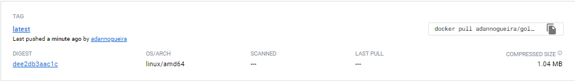

# **GOLANG SMALL IMAGE**

This is a docker challenge to build a very small docker image for a "Hello world" app, the image is published [here](https://hub.docker.com/r/adannogueira/golang-small_hello).

## Image size reference

